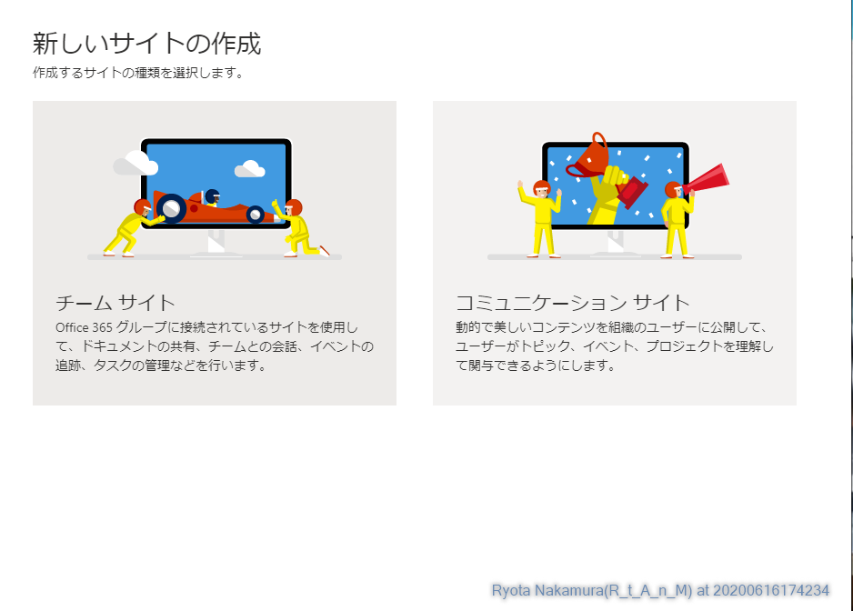

# リモート出退勤報告アプリ

# 1. 前提条件

本アプリを使用する際は、使用する方全員に対し、以下のいずれかに該当するライセンスが必要となります。

* Microsoft 365 Business Basic 以上
* Office 365 E1 以上

# 2. Share Point環境の構築

本アプリのデータソースには、Share Point リストを使用しています。
そのため、まずはShare Point のリストを作成する必要があります。
本作業を行うには、環境によって管理権限が必要となる場合がありますので、その際は環境の管理者にその旨ご相談ください。

## 2.1 Share Point サイトの作成

1. トップメニューより Share Point を起動する。

2. サイトの作成をクリックする。

3. 作りたいサイトを選択し、クリックする。（本資料ではコミュニケーションサイトを前提とする）

4. 任意のサイト名などを入力し、完了をクリックする。

5. サイトが作成される

## 2.2 Share Point リストを作成する

1. サイト コンテンツをクリックする

2. 新規からリストをクリックする

3. リスト名を SYS_TBL_Work_InOut_log `とし、サイトナビゲーションに表示のチェックを無効化して作成をクリックする

4. リストが作成される

5. 同様に、SYS_TBL_Work_InOut_Temp_log も作成する。

## 2.3 SYS_TBL_Work_InOut_log の設定変更

SYS_TBL_Work_InOut_log のリスト構造はこのようになっている

|列名|種類|必須|選択値|既定値|
|:--|:--|:--|:--|:--|
|Full_Name|1行テキスト|True|||
|Work_Status|選択肢|True|出勤・休憩開始・休憩完了・退勤|出勤|
|Latitude|数値|True|||
|Longitude|数値|True|||
|Add_Day|1行テキスト|True|||

1．SYS_TBL_Work_InOut_logを開き、設定からリストの設定をクリック

